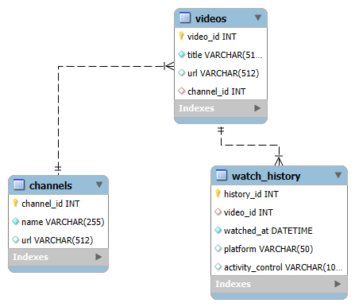

# Design Document

# Personal YouTube Rewind
*A Structured Look into Your Watch History*

By Fabio H B Lopes

Video overview: <(https://www.youtube.com/watch?v=5qNqZmix3SM)>

## Scope

I've watched countless YouTube videos throughout my life, and now, with this database, I can accurately analyze my video watching patterns. The goal of this project is to transform raw Google Takeout data into a relational schema for structured querying.

In the scope of my database, I am including all the data provided by Google via the Takeout archive under `watch-history.json`. This includes:
- Video title
- Channel name
- Time of watching (timestamp)
- Video URL

Data such as video duration and watch time is **not available** and therefore **excluded** from the schema.

This database is read-only, primarily for analytical purposes, and will allow me to perform queries like identifying the most watched channels, most frequently rewatched videos, and when I’m most active on YouTube.

## Functional Requirements
As a user, you *can*:
- View the **top channels** by watch count.
- View the **most rewatched videos**.
- **Search** for videos watched from a specific channel.
- Count the **total number of videos watched**.
- Count the number of **unique channels watched**.
- Analyze **watch behavior over time** (e.g., by hour, day, or month).

You *cannot*:
- View total **watch time** or **video duration**, as this data isn’t available in the export.
- Analyze engagement metrics like likes, comments, or shares.
- Query more than ~1 year of data, due to Google Takeout’s history limitations.

## Representation

### Entities

The database includes three core entities:

#### 1. `Channels`
- `channel_id` (Primary Key): A hashed identifier derived from the channel URL.
- `name`: The display name of the channel.
- `url`: The channel’s YouTube URL.

*Rationale*: Channels are represented as a separate entity to avoid redundancy, as many videos are watched from the same channel.

#### 2. `Videos`
- `video_id` (Primary Key): A unique ID extracted from the YouTube video URL.
- `title`: The title of the video.
- `url`: The YouTube video link.
- `channel_id` (Foreign Key): Links to the `Channels` table.

*Rationale*: Videos are stored separately for normalization and easier cross-referencing.

#### 3. `Watch_History`
- `id` (Primary Key): Auto-incremented ID for each watch event.
- `video_id` (Foreign Key): Refers to the watched video.
- `watched_at`: The timestamp of when the video was watched.

*Rationale*: This table stores watch events and links to specific videos. This allows tracking of repeat views and time-based analysis.

### Relationships

In this section you should include your entity relationship diagram and describe the relationships between the entities in your database.

## Optimizations

- Created an index on `Watch_History.video_id` to speed up aggregation queries (e.g., counting how many times each video was watched).
- Created an index on `Videos.channel_id` for faster joins and filtering by channel.
- Created views for "Most Watched Channels" and "Most Watched Videos" to simplify frequent analytical queries.

These optimizations were made to improve the responsiveness of common queries while maintaining clarity in the base schema.

## Limitations

- **Limited time range**: Google Takeout often includes only ~1 year of watch history. Older data may not be available.
- **No duration or interaction data**: We cannot calculate total watch time or identify whether a video was watched in full.
- **Limited granularity**: Only the timestamp is available, no data on device used or playback behavior.
- **Static data**: This database does not auto-update. It reflects a snapshot of the moment when the Takeout was downloaded.

Despite these limitations, this project provides valuable insights into personal YouTube behavior and offers a strong foundation for data analysis.
